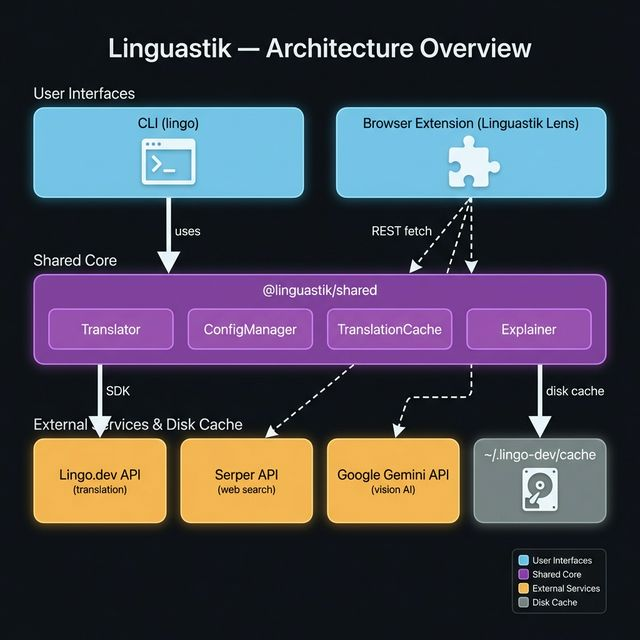
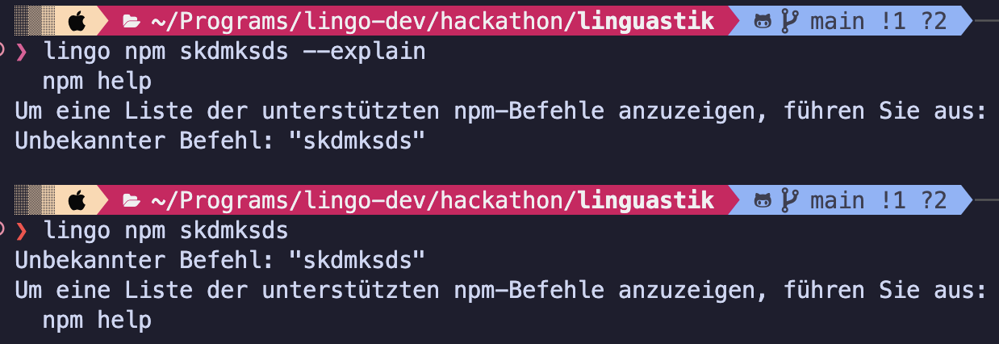
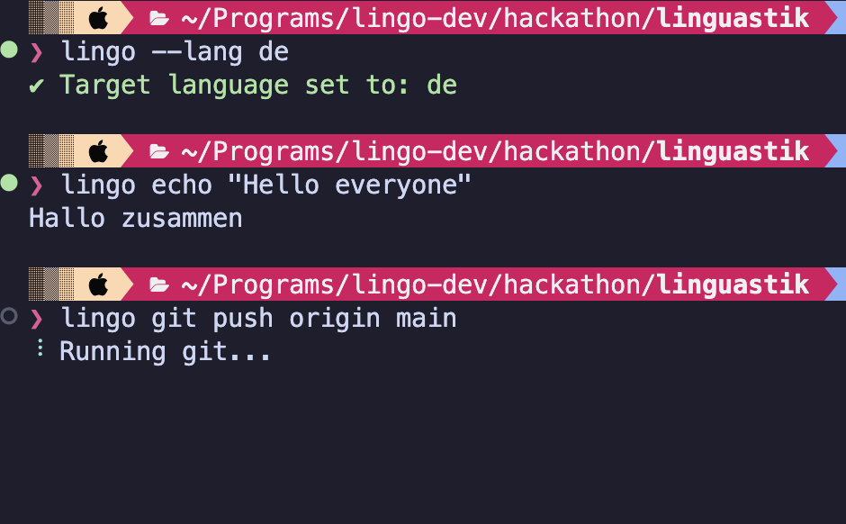
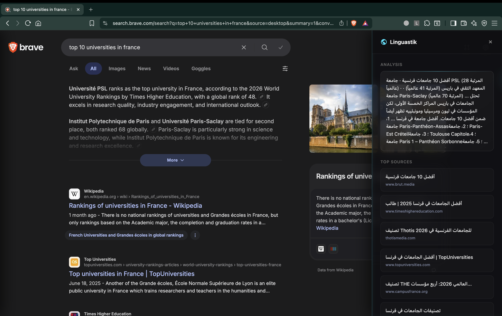
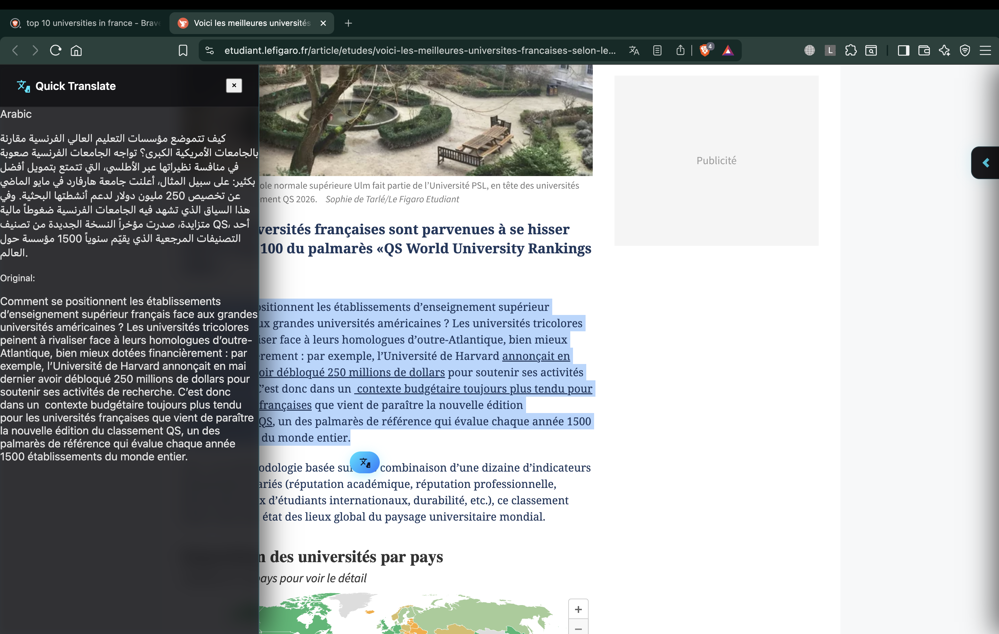
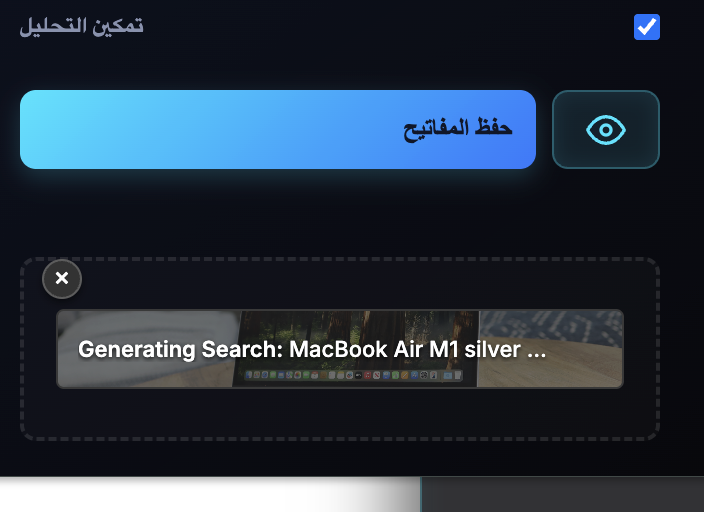
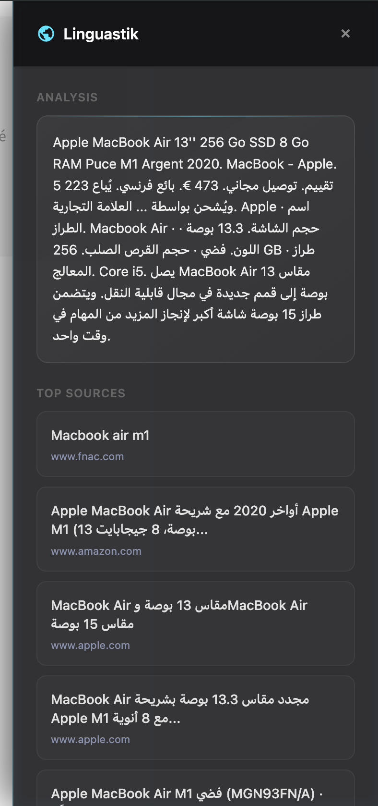

# Linguastik

**Break the language barrier in your terminal and your browser — powered by [Lingo.dev](https://lingo.dev) and Google Gemini.**

**Demo Video: (In Production)**

Linguastik is a developer toolset that makes the web and your command line readable in any language. It ships as two separate tools that share the same translation backbone:

- **Linguastik CLI** — a command wrapper that translates terminal output in real time.
- **Linguastik Lens** — a browser extension that gives you a multi-lingual perspective on every web search.



---

## Features

### Linguastik CLI (`lingo`)

- **Real-time output translation** — wrap any terminal command (`npm`, `git`, `docker`, etc.) and read its output in your language as it streams.

 

- **Error explainer** — when a command fails, run it with `--explain` to get a structured breakdown of the problem, its likely causes, and actionable fixes.

 

- **Persistent settings** — configure your API key and target language once; they're saved locally and remembered between sessions.

 

- **Smart caching** — translations are cached on disk so repeated output is instant and doesn't hit the API again.

### Linguastik Lens (Browser Extension)

- **Multi-lingual search** — every Google search triggers a parallel search in your target language, pulling in results from different regions of the world. All results are merged and displayed side by side.

- **AI-powered summaries** — the top results are summarized and translated into your native language automatically.



- **Quick translate** — highlight any text on a webpage and instantly see its translation in a slide-out sidebar.



- **Vision search** — upload or paste an image in the extension popup, and Gemini AI will identify what's in it and search for it across languages.





- **Localized popup UI** — the extension's own interface translates itself into your chosen language.


---

## Quick Start

### Prerequisites

```bash
# Clone the repository
git clone https://github.com/blueberry-adii/linguastik.git
cd linguastik

# Install dependencies
npm install

# Build the project
npm run build
```

### CLI

```bash
# Link the lingo command globally
cd packages/cli && npm link && cd ../..

# Set your Lingo.dev API key
lingo --key <your-lingo.dev-api-key>

# Set your target language (e.g. Japanese, Spanish, French)
lingo --lang ja

# Wrap any command to translate its output
lingo npm install
lingo git status

# Get a structured explanation of errors
lingo --explain git push origin main
```

### Browser Extension

1. Build the project (`npm run build` from the root).
2. Open Chrome and go to `chrome://extensions`.
3. Enable **Developer mode** and click **Load unpacked**.
4. Select the `packages/extension/dist` folder.
5. Click the Linguastik icon and enter your **Serper**, **Lingo.dev**, and **Gemini** API keys.
6. Search on Google — the sidebar appears automatically.

---

## API Keys Required

| Key           | Where to get it                        | Used by                       |
| ------------- | -------------------------------------- | ----------------------------- |
| Lingo.dev     | [lingo.dev](https://lingo.dev)         | CLI + Extension (translation) |
| Serper        | [serper.dev](https://serper.dev)       | Extension (web search)        |
| Google Gemini | [ai.google.dev](https://ai.google.dev) | Extension (Vision AI)         |

---

## Documentation

For a detailed breakdown of every module, function, and design decision, see the **[`docs`](./docs/README.md)** directory.
